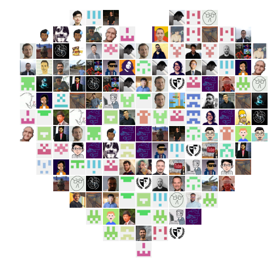

# Heart Maker

A script by [Jina AI](https://github.com/jina-ai/jina/) to show love for our GitHub contributors

  

This script:
- scrapes a list of contributor avatar images from all the repositories of a GitHub organization
- creates a mosaic of the images in the shape of a heart
- presents the heart and allow saving as image

## Usage

1. [Generate a new GitHub token](https://github.com/settings/tokens). Ensure **read:org** and **read:user** are checked
2. Export the token as an environment variable: `export GITHUB_TOKEN=<whatever_your_token_is>`
3. Clone this repo: `git clone git@github.com:jina-ai/devrel-heartmaker.git`
4. `cd devrel-heartmaker`
6. `pip install -r requirements.txt`
7. `python app.py --org=<your_org_name>`
8. The script will take a while (the more contributors, the more time)
9. A window will pop up allowing you to view and save the heart mosaic

## FAQ

### How can I change the size of the avatars/heart?

Tweak `grid_size` in `app.py`

### Why are some avatars duplicated?

There are only a finite number of ways to fill a heart. You couldn't do it with just 1 or 2 avatars without duplication after all. As long as there are gaps in the heart, they have to be filled somehow, and we do this via duplication

### I have too many contributors, and I can't show them all

Change `grid_size = 20` to a larger number, say `grid_size = 30` (~ 150 contributors), `grid_size = 40` (~ 200 contributors) 

## What Can You Do With It?

### Personalized Thanksgiving Social Banners

## Inspiration

- [code golf - Draw/plot a heart graph - Code Golf Stack Exchange](https://codegolf.stackexchange.com/questions/109917/draw-plot-a-heart-graph)
- [all-contributors/all-contributors: ✨ Recognize all contributors, not just the ones who push code ✨](https://github.com/all-contributors/all-contributors)
